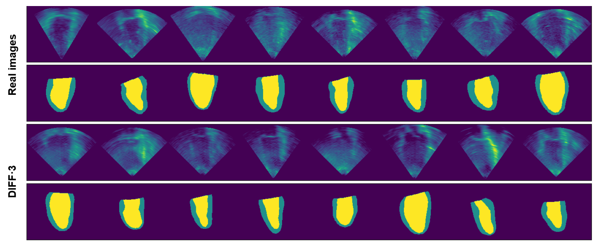
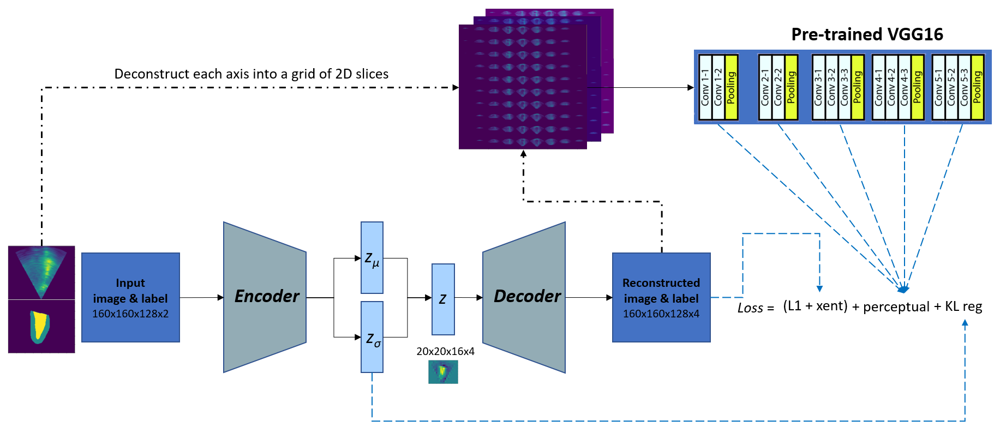

# DIFF-3

DIFF-3 *(read: DIFF-E)* is a **3D echo** synthetic data generation with **paired labels**. 
This is a PyTorch implementation of the [paper](https://link.springer.com/chapter/10.1007/978-3-031-44689-4_13) submitted to SASHIMI workshop, MICCAI 2023.

## Sample data

Comparison between real and synthetic images+labels generated by DIFF-3

<p align="center">
    
</p>

## How To

### Requirements

A conda environment named diff3 can be created and activated with

```
conda env create -f environment.yaml
conda activate diff3
```

Install **diff3** as a package. Go to the directory where the setup.py is located and type
`pip install -e .`

### 1. VAE Training

#### Prepare training data

Prepare the data by resizing it to 160x160x128. Images are normalized and saved to .npy files by default.

    >> python prepare_data.py --data-dir DATA_DIR --label-dir LABEL_DIR [--image-size IMAGE_SIZE [IMAGE_SIZE ...]] --output-dir OUTPUT_DIR [--subset DATA_SUBSET]
                     [--format FORMAT]

#### Train VAE

Train VAE for 200 epochs with KL_weight adjusted from 1e-6 to 1 after 100 epochs.

Configure the training parameters in the config file, e.g. `./configs/vae_xent.yaml`

    >> python autoencoder/trainer_autoencoderKL.py --config ./configs/vae_xent.yaml

##### Examples

For the first 100 epochs use:

    >> python trainer_autoencoderKL.py --config ./configs/vae_100.yaml

After the training, edit the `vae_200.yaml` and change the ckpt_path to the latest checkpoint, then run:

    >> python trainer_autoencoderKL.py --config ./configs/vae_200.yaml

### 2. LDM (DDPM) training

#### Prepare training data

Prepare the data by exporting the latent space of the training data using the VAE model that was just trained. Output will be saved in H5 file format.

    >> python autoencoder/export_latent.py  [--subset SUBSET] --model-dir MODEL_DIR --output-dir OUTPUT_DIR [--version VERSION]

H5 file contains minimum and maximum values of the latent space, which will be used to normalize the latent space during training. Mean and std of the latent space is saved in separate columns to be used for the sampling process during LDM training.

#### Train LDM

Copy the latent space training set to another qdirectory if you wish, this will be used as the INPUT data. Fill in VER number to keep track of the expriment.

By default DIFF-3 will be trained for 50000 iterations

    >> python ldm/trainer_ldm_3d.py --input INPUT --model-dir MODEL_DIR [--batch-size BATCH_SIZE]

### 3. Inference

Inference consists of two steps: sampling and reconstruction.

Generate latent samples from the trained LDM model. The latent samples will be saved in H5 file format.

    >> python ldm/generate_samples.py --model-dir MODEL_DIR --model-id MODEL_ID --output-dir OUTPUT_DIR [--version VERSION] [--n-data N_DATA]

Generate synthetic images+labels by decoding the latent samples

    >> python autoencoder/gen_synthetic.py --model-dir MODEL_DIR --input INPUT [--n-data N_DATA] --output-dir OUTPUT_DIR

#### Examples

Generate samples using LDM and save samples to output directory. By default will be saved as `_samples[version].h5` in the output directory.

Load the \_samples[version].h5 file as input and decode them using VAE model By default will be saved as `_synthetic_samples[version].h5` in the output directory.

    >> python generate_samples.py --model-dir models/diff3_model_2 --model-id 50 --output-dir output/ --version 2 --n-data 32

    >> python generate_synthetic.py --model-dir models/vae_2 --input output/_samples2.h5 --output-dir output/

## Network overview

DIFF-3 is an unconditioned Latent Diffusion Model (LDM) consisting of two stages:

1. Variational Auto Encoder (VAE)
2. Denoising Diffusion Probabilistic Model (DDPM)

The code is modified based on the original implementation from [Latent Diffusion Models](https://github.com/CompVis/latent-diffusion) and [DDPM](https://github.com/lucidrains/denoising-diffusion-pytorch) github, and adjusted to allow for 3D images+labels.

The image below shows the overview of the VAE network.

<p align="center">
    
</p>
